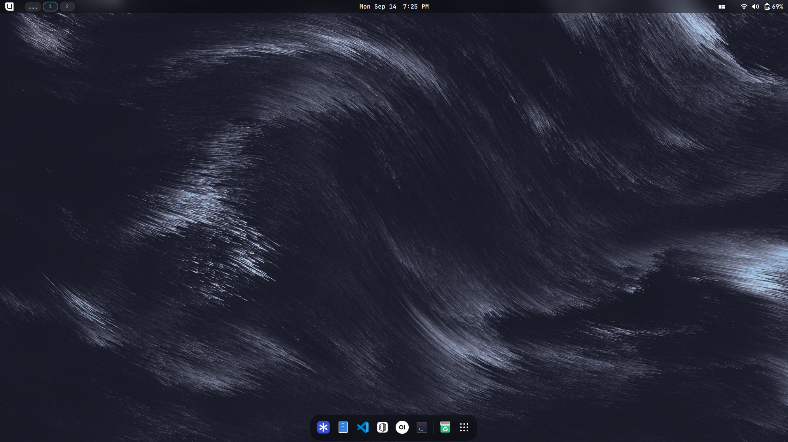
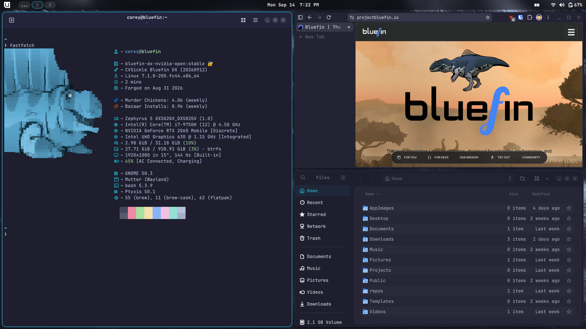

# Bluefin DX

[](https://github.com/cvsickle/bluefin-dx/actions/workflows/build.yml) &nbsp; [](https://github.com/cvsickle/bluefin-dx/actions/workflows/dependabot/dependabot-updates) &nbsp; [](https://github.com/cvsickle/bluefin-dx/actions/workflows/renovate.yml) &nbsp; [](https://github.com/cvsickle/bluefin-dx/actions/workflows/sync_codeberg.yaml)

---

This repository is a custom [bootc](https://github.com/bootc-dev/bootc) image built on [Bluefin-DX](https://github.com/ublue-os/bluefin).

It was created using the [BlueBuild Workshop](https://workshop.blue-build.org/).

 &nbsp; 

## Changes made

### System packages added

- Everything needed for [LazyVim](https://github.com/lazyvim/lazyvim)
  - [Neovim](https://github.com/neovim/neovim)
  - [LazyGit](https://github.com/jesseduffield/lazygit)
  - JetBrains Mono Nerd Font from [ryanoasis/nerd-fonts](https://github.com/ryanoasis/nerd-fonts)
  - Etc.
- [Helium Browser](https://github.com/imputnet/helium)
- Dependencies for [Fausto-Korpsvart](https://github.com/Fausto-Korpsvart) themes.
- Swapped `tuned-ppd` for `power-profiles-daemon` for optimization on Framework 13 Pro. See the [Phoronix writeup](https://www.phoronix.com/review/fedora-pantherlake-thermald-tuned).

### System packages removed

- `gnome-tour`
- `malcontent-control`

### Brew

- [Dev Container CLI](https://github.com/devcontainers/cli)
- [LazyDocker](https://github.com/jesseduffield/lazydocker)

### Flatpak

- [Easy Effects](https://flathub.org/en/apps/com.github.wwmm.easyeffects)
- [Gear Lever](https://flathub.org/en/apps/it.mijorus.gearlever)
- [Web Apps](https://flathub.org/en/apps/net.codelogistics.webapps)
- [SiriKali](https://flathub.org/en/apps/io.github.mhogomchungu.sirikali)

### GNOME extensions added

- [Alphabetical App Grid](https://extensions.gnome.org/extension/4269/alphabetical-app-grid/)
- [O-tiling](https://extensions.gnome.org/extension/9875/o-tiling/)

### GNOME extensions removed

- Apps Menu
- Places Status Indicator

## Installation

THere is the recommened installation process.

- Flash the Stable Bluefin ISO from [projectbluefin.io](https://projectbluefin.io/) onto a USB.
- Boot from the USB and install Bluefin.
- Boot into Bluefin and switch it to developer mode.

> [!TIP]
> This process should work from any Fedora-based bootc image.

```bash
# Switch to developer mode.
ujust devmode
# Reboot when done.
systemctl reboot
```

- Once in developer mode, switch to this image.

```bash
# Normal image
sudo bootc switch ghcr.io/cvsickle/bluefin-dx:latest
# Nvidia image
sudo bootc switch ghcr.io/cvsickle/bluefin-dx-nvidia:latest

# Reboot when done.
systemctl reboot
```

- Once booted into this image, enable signing verification.

```bash
# Normal image
sudo bootc switch --enforce-container-sigpolicy ghcr.io/cvsickle/bluefin-dx:latest
# Nvidia image
sudo bootc switch --enforce-container-sigpolicy ghcr.io/cvsickle/bluefin-dx-nvidia:latest
```

- If the boot loader menu entries are still showing the upstream image name, force them to update.

```bash
sudo rpm-ostree kargs --append=bls.refresh=1
systemctl reboot

sudo rpm-ostree kargs --delete=bls.refresh=1
systemctl reboot
```

## Recommended GTK Theming

Want to make your apps look less gray? Check out the [theming instructions](./docs/themes.md).

## Verification

These images are signed with [Sigstore](https://www.sigstore.dev/)'s [cosign](https://github.com/sigstore/cosign). You can verify the signature by downloading the `cosign.pub` file from this repo and running the following command:

```bash
cosign verify --key cosign.pub ghcr.io/cvsickle/bluefin-dx
```

## Repository Mirrors

- GitHub - [https://github.com/cvsickle/bluefin-dx](https://github.com/cvsickle/bluefin-dx)
- Codeberg - [https://codeberg.org/cvsickle/bluefin-dx](https://codeberg.org/cvsickle/bluefin-dx)
- Forgejo (Mirror) - [https://git.cvsickle.com/cvsickle/bluefin-dx](https://git.cvsickle.com/cvsickle/bluefin-dx)
